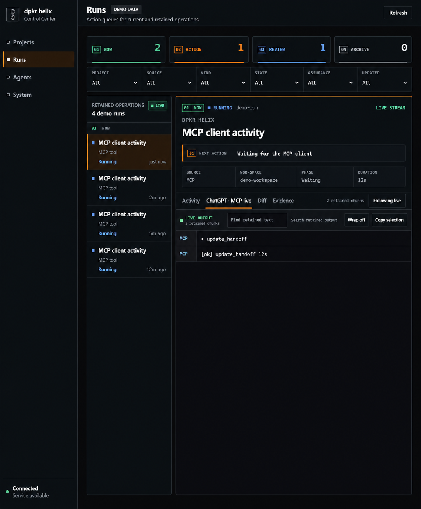

<p align="center">
  <picture>
    <source media="(prefers-color-scheme: dark)" srcset="./src/ui/dpkr-helix-icon.png">
    
  </picture>
</p>

<h1 align="center">dpkr helix</h1>

<p align="center">
  A secure local coding control center for ChatGPT, Codex, Claude, and other MCP-capable hosts.
</p>

<p align="center">
  Official product introduction: <a href="https://dpkr.dev">dpkr.dev</a><br>
  MCP endpoints are configured separately for each installation.
</p>

<p align="center">
  <a href="https://dpkr.dev"></a>
  <a href="./docs/setup-windows.md"></a>
  <a href="https://github.com/vellyalis/dpkr-helix/actions/workflows/ci.yml"></a>
  <a href="./LICENSE"></a>
</p>

[](./docs/assets/dpkr-helix-dashboard.png)

dpkr helix scopes its file tools to the local development folders you approve.
A connected MCP host can inspect files, make scoped edits, run tests and builds,
and use the live operations dashboard to show what is happening as it happens.
Shell commands run with the operating-system permissions of the dpkr helix
process and are not confined by the file-tool allowlist.

dpkr helix is distributed from this repository as source. There is currently
no dpkr helix npm publication. The internal `@waishnav/devspace` package name
is retained only for compatibility and is protected from accidental
publication; clone this repository when you want dpkr helix itself.

## What it gives you

- approved-root scoping for file read, edit, and search tools
- direct file read, edit, search, and shell tools
- reusable workspaces for each project or Git worktree
- a terminal-style live feed for active and retained operations
- project permission presets for inspect, design, and development work
- persistent handoffs so work can resume across sessions on one installation
- support for project instructions in `AGENTS.md` and `CLAUDE.md`
- explicit ChatGPT-initiated updates with local verification and rollback on the portable Windows installation

## Roadmap

The local coding, project-policy, handoff, delegation, and live-operations
baseline and measured Codex-quality parity program are shipped. The optional
GPT-5.6 Sol effort matrix was stopped incomplete because it no longer changed a
current product or setting decision. The next workstream observes a real daily
ChatGPT workflow and invests only in measured correctness, continuity, or
operational friction.

| Horizon | Status | Focus |
| --- | --- | --- |
| Current baseline | Shipped | Secure workspace tools, project workflows, handoffs, local-agent delegation, and operations visibility |
| Measured parity | Shipped | Frozen parity fixtures, bounded repository context, verification freshness, structured outcomes, bounded waiting, and signed-in convergence |
| Next workstream | Next | Fresh-session operational-quality observation followed by one evidence-selected improvement, if a real gap is found |
| Later ideas | Not committed | Consider only after a measured gap or concrete user requirement justifies them |

See the [public roadmap](./docs/ROADMAP.md) for the ordered milestones, exit
rules, and explicit non-commitments. The roadmap has no calendar promise:
quality and security evidence determine when a milestone is complete.

## Install on Windows

Clone the repository into a folder named `dpkr-helix`, preview the installation,
and then install:

```powershell
git clone https://github.com/vellyalis/dpkr-helix.git
Set-Location .\dpkr-helix

# Read-only preview: no install, login, configuration write, or process start.
powershell -ExecutionPolicy Bypass -File .\scripts\setup-windows.ps1 `
  -Mode Plan `
  -AllowedRoot C:\src\my-project

# Install after checking the preview.
powershell -ExecutionPolicy Bypass -File .\scripts\setup-windows.ps1 `
  -AllowedRoot C:\src\my-project
```

Only add project roots that the connected MCP host genuinely needs. Codex,
ChatGPT, Cloudflare, and OpenAI authorization remains interactive on each PC.
From a Codex session in this clone, invoke `$onboard-dpkr-helix` for the guided
stable-endpoint, ChatGPT app, OAuth, and optional no-console recovery workflow.
See the [portable Windows setup guide](./docs/setup-windows.md) for the same
human-readable start, stop, update, recovery, and rollback contract.

## Manual install

dpkr helix requires Node `>=22.19 <27`.

```bash
npm ci
npm run build
npm install --global .
```

The product name is `dpkr helix`. The npm package name, `devspace` command, MCP
protocol identity, and `~/.devspace` storage path remain unchanged so existing
installations and clients continue to work. This compatibility identity is not
an instruction to install the upstream npm package when you want this fork.

Initialize and start the service:

```bash
devspace init
devspace serve
```

During initialization, dpkr helix asks for:

- the local project folders the MCP host may open
- the local port, usually `7676`
- the public HTTPS origin supplied by Cloudflare Tunnel, ngrok, Pinggy,
  Tailscale Funnel, or another reverse proxy

Enter the public origin without `/mcp`:

```text
https://your-tunnel-host.example.com
```

The MCP client connects to:

```text
https://your-tunnel-host.example.com/mcp
```

For local-only access, the default endpoint is:

```text
http://127.0.0.1:7676/mcp
```

When a client first connects, dpkr helix opens an Owner approval page. Use the
password printed by `devspace init` and stored locally in
`~/.devspace/auth.json`. Keep it private.

## Normal workflow

1. Start the configured HTTPS tunnel.
2. Run `devspace serve`.
3. Connect the MCP host to the public `/mcp` endpoint.
4. Approve the connection with the Owner password.
5. Ask the host to open a project inside an approved root.
6. Open the dpkr helix dashboard to watch tools, output, diffs, and verification.

The dashboard separates current work from action items, review, and retained
history. Its live feed follows active MCP and local-agent operations without
creating a second execution engine.

## Security model

dpkr helix is remote access to a local machine. File tools are scoped to
selected local folders, but an authorized client can run shell commands with
the operating-system permissions of the account running the service.

- start with the narrowest practical filesystem allowlist
- use a strong Owner password and a tunnel you control
- review requested roots before approving them
- run the service under a dedicated, least-privilege account that cannot access
  unrelated credentials or private files
- remember that file excerpts and command output returned by tools are sent to
  the connected MCP host

Read the full [security model](./docs/security.md) before exposing the service
outside localhost.

## Platform support

| Platform                                          | Status            | Notes                                          |
| ------------------------------------------------- | ----------------- | ---------------------------------------------- |
| Linux                                             | Supported         | Requires Node, npm, Git, and Bash.             |
| macOS                                             | Supported         | Requires Node, npm, Git, and Bash.             |
| Windows with Git Bash, WSL, MSYS2, or Cygwin Bash | Supported         | Git Bash is the simplest native Windows setup. |
| Windows PowerShell or `cmd.exe` only              | Not supported yet | Install Git Bash or use WSL.                   |

Check the local environment with:

```bash
devspace doctor
```

## MCP host compatibility

dpkr helix serves a remote Streamable HTTP MCP endpoint with OAuth. The host
must support that transport, the discovered tool schemas, and the actions you
intend to use.

- ChatGPT developer-mode app availability and write-tool support depend on the
  current plan and workspace policy. Check the
  [official OpenAI developer-mode documentation](https://help.openai.com/en/articles/12584461-developer-mode-apps-and-full-mcp-connectors-in-chatgpt-beta)
  before promising a particular permission level.
- Codex, Claude, and other MCP clients may expose different approval,
  annotation, UI, or long-running-process behavior even when they connect to
  the same endpoint.
- Always prove project selection and one read-only call before enabling broader
  actions on a new host.

## Documentation

- [Portable Windows setup](./docs/setup-windows.md)
- [Setup guide](./docs/setup.md)
- [ChatGPT coding workflow](./docs/chatgpt-coding-workflow.md)
- [Configuration reference](./docs/configuration.md)
- [Native file download](./docs/artifact-exchange.md)
- [Security model](./docs/security.md)
- [Troubleshooting](./docs/gotchas.md)
- [Roadmap](./docs/ROADMAP.md)
- [Public release runbook](./docs/PUBLIC_RELEASE.md)
- [Requirements and evidence](./docs/control-center/14_REQUIREMENTS_EVIDENCE_MATRIX.md)
- [Security reporting](./SECURITY.md)
- [Contributing](./CONTRIBUTING.md)

## Acknowledgements

dpkr helix builds on [DevSpace by Waishnav](https://github.com/Waishnav/devspace).
The upstream MIT license and copyright notice are retained in
[LICENSE](./LICENSE). See [NOTICE](./NOTICE.md) for the compatibility-name and
distribution boundary.

## Local development

```bash
npm ci --no-audit
npm run audit:production
npm run dev
npm run typecheck
npm test
npm run build
```

Use `npm ci --no-audit`, followed by the explicit post-install
`npm run audit:production`, so local development, CI, and packaged CLI
verification all use and audit the same reviewed dependency tree.
